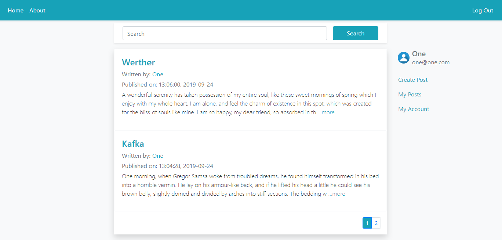

# Social Blog

A simple Web Social Blog. Written in Python Flask, it can be used by companies, groups, and or organizations to provide discussion and communication about their topics.



Not authenticated users can see all posts inside the blog. Logged users can create, update, delete their own posts. 

## 1) Installation

Clone the repository:

```
git clone https://github.com/higorspinto/Social-Blog.git
```

### Dependencies

All dependencies can be installed using requirements.txt.

```
pip install requirements.txt
```

## 2) Setting Up the Database

The database is configured to use SQLite. All the data will be stored in a file called *data.sqlite*.

#### Migrations

[Flask-Migrate](https://flask-migrate.readthedocs.io/en/latest/) is an extension that handles SQLAlchemy database migrations for Flask applications. The database operations are made available through the Flask command-line interface or through the Flask-Script extension.

_________________________________________________________________________________________

#### 2.1) In the same directory of the cloned repository, set up the environment variable.

Windows Users need to run:

```
set FLASK_APP=app.py
```

MacOS/Linux users run:

```
export FLASK_APP=app.py 
```

#### 2.2) Database initialization and migrate.

```
flask db init
flask db migrate -m "Creating the database"
flask db upgrade
```

